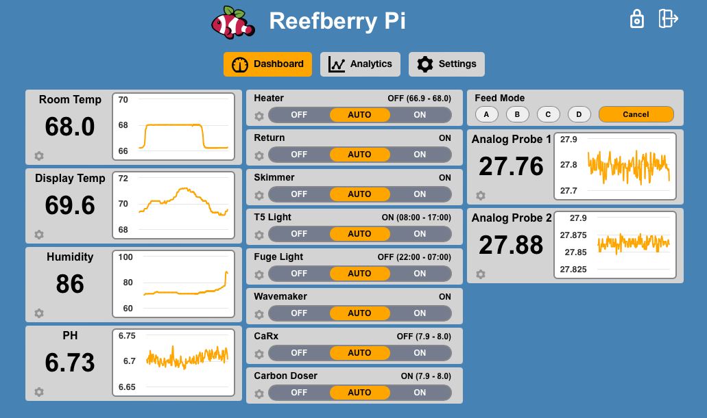
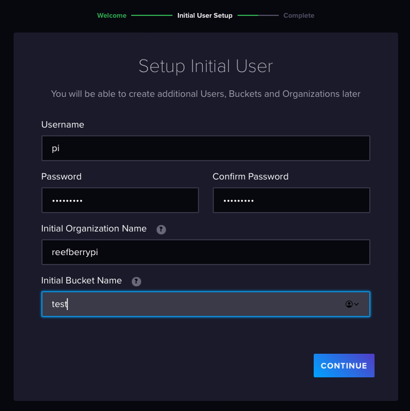
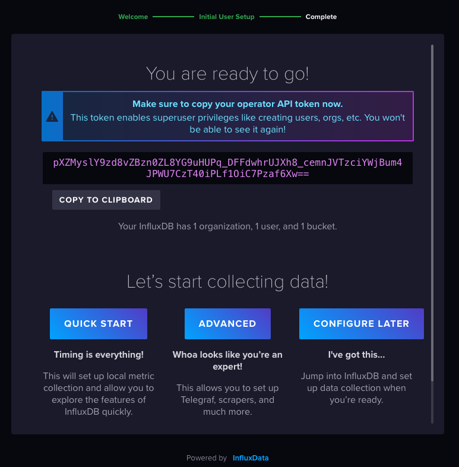

# Reefberry Pi



Reefberry Pi is an aquarium controller built with a Raspberry Pi 
single board computer.  I started this project to learn new skills and see what I could accomplish with this device and off the shelf components.  It is a work in progress and I have lots of ideas for things I'd like to implement.  Fell free to follow along on this journey! 

# Features

* s18b20 submersible temperature probes (maximum 4)
* DHT-22 temerature and humidity sensor (maximum 1)
* relays to control outlets (maximum 8)
* mcp3008 analog to digital converter (for things like PH probes) (8 channels)
* different outlet profiles (Always, Return Pump, Skimmer, Light, PH, Heater)
* configurable dashboard
* data logging and graphical displays
* ability to enable or disbale features as necessary
* login screen
* configurable feed modes (4 modes)
* ability to switch between Celcius or Fahrenheit

# Prerequisites
Raspberry Pi (tested on 3B) \
RaspberryPi OS (64-bit) \
Influx Database 2.0 \
MariaDB \
Python 3 \
Apache Web Server 

# Configuration
If installing on Raspberry Pi 3B you should increase the amount of swap space since RPi 3B only has 1GB of memory.  Raspberry Pi 4 and later should have enough RAM to run everything smoothly so this step is unecessary.

## Increasing Swap Space (for Raspberry Pi 3B)
(refer to https://pimylifeup.com/raspberry-pi-swap-file/)

```
sudo dphys-swapfile swapoff 
sudo nano /etc/dphys-swapfile 
```
Find:  
```
CONF_SWAPSIZE=100 
```
Change value to this and save:
```
CONF_SWAPSIZE=1024 
```

Activate the new swap space by executing following commands:
```
sudo dphys-swapfile setup 
sudo dphys-swapfile swapon 
sudo reboot 
```

Verify with: 
```
free -m 
```
# Update Raspberry Pi OS
It is good practice to update Raspberry Pi OS to ensure latest patches are installed

``` 
sudo apt update
sudo apt upgrade
```

## Installation of MariaDB
(refer to https://pimylifeup.com/raspberry-pi-mysql/ )

```
sudo apt install mariadb-server
sudo mysql_secure_installation
```
when prompted for password, just hit **ENTER** (we will add password later): 
```
Enter current password for root (enter for none): 
```
when prompted for unix_socket authentication, press "**n**"

```
Switch to unix_socket authentication [Y/n] n
```
When prompted to change root password, press "**y**"
```
Change the root password? [Y/n] y
```

Set password to ‘**reefberry**’
```
Change the root password? [Y/n] y
New password: 
Re-enter new password: 
Password updated successfully!
```
When prompted to remove anopnymous users, press "**y**"

```
Remove anonymous users? [Y/n] y
```

When prompted to disallow root login remotely, press "**y**" (we will add a remote user later)

```
Disallow root login remotely? [Y/n] y
```
When prompted to remove the test database, press "**y**"
```
Remove test database and access to it? [Y/n] y
```
When prompted to reload privlege tables, press "**y**"

```
Reload privilege tables now? [Y/n] y
```
Next we will allow **remote access** to  the database \
(this is helpful while configuring and debugging things remotely): \
(refer to
https://webdock.io/en/docs/how-guides/database-guides/how-enable-remote-access-your-mariadbmysql-database )
```
sudo nano /etc/mysql/mariadb.conf.d/50-server.cnf
```
Change the value of bind-address to **0.0.0.0** then save changes (default was 127.0.0.1): 
```
bind-address = 0.0.0.0 
```


Now login to the database command line as user "root" (use the password we set earlier)
```
sudo mysql -u root -p
```
We will create a new account fro the aquarium controller and grant full access to DB.  This account will be able to login remotely from all IPs: 

(run this command on MariaDB command line)
```
GRANT ALL ON *.* to 'pi'@'%' IDENTIFIED BY 'reefberry' WITH GRANT OPTION;
```

restart database service:
```
sudo systemctl restart mariadb
```


## Installation of Influx Database
(refer to https://pimylifeup.com/raspberry-pi-influxdb/)

Add InfluxDB repository:
```
curl https://repos.influxdata.com/influxdata-archive.key | gpg --dearmor | sudo tee /usr/share/keyrings/influxdb-archive-keyring.gpg > /dev/null
```
```
echo "deb [signed-by=/usr/share/keyrings/influxdb-archive-keyring.gpg] https://repos.influxdata.com/debian stable main" | sudo tee /etc/apt/sources.list.d/influxdb.list
```
```
sudo apt update
sudo apt install influxdb2
```
Make it start on boot: 
```
sudo systemctl unmask influxdb
sudo systemctl enable influxdb
sudo systemctl start influxdb
```
Finish setting up InfluxDB by going to:
```
http://<serverip>:8086
```
Fill in fields and click **Continue**:
```
Username = pi 
Password = reefberry
Initial Organization Name = reefberrypi
Initial Bucket Name = test
```


Copy your API token, then click **Configure Later**. We will use it when configuring the Reefberry Pi controller.  If you lose the token a new one can always be generated later:



## Install Apache Webserver
(refer to https://pimylifeup.com/raspberry-pi-apache/)
```
sudo apt install apache2 -y
```
Give privileges to user **pi**:
```
sudo usermod -a -G www-data pi
sudo chown -R -f www-data:www-data /var/www/html
```
```
sudo reboot 
```
Test apache is running by going to the url below.  You should see the Apache welcome page:
```
http://<servername>
```

## Set up Reefberry Pi
Clone the Reefberry Pi Git repository 

```
cd ~
git clone https://github.com/ReefSpy/ReefberryPi.git
```

### Setup the aquarium controller backend

create installation directory:
```
sudo mkdir /usr/local/bin/reefberrypi
```
copy source files to installation directory:
```
sudo cp ReefberryPi/controller/* /usr/local/bin/reefberrypi
```

Install Python dependencies from requirements.txt:
```
python -m pip install -r ReefberryPi/controller/requirements.txt
```

create an initial config.ini file:
```
sudo nano /usr/local/bin/reefberrypi/config.ini
```
Enter the following values, and save (be sure to add the **InfluxDB API Token** you copied earlier!):

```
[global]
appuid = 
influxdb_host = http://localhost:8086
influxdb_org = reefberrypi
influxdb_token = REPLACE_WITH_YOUR_TOKEN_FROM EARLIER
mqtt_broker_host = localhost
mysql_host = localhost
mysql_user = pi
mysql_password = reefberry
mysql_database = reefberrypi
mysql_port = 3306
```

Give ownership of the installation directory to user **pi** and make the start script executable:
```
sudo chown -R pi: /usr/local/bin/reefberrypi/
sudo chmod +x /usr/local/bin/reefberrypi/rbp-start.sh
```

Setup the Reefberry Pi service:
```
 sudo cp /usr/local/bin/reefberrypi/reefberrypi.service /etc/systemd/system/
 sudo systemctl enable reefberrypi.service
 sudo systemctl start reefberrypi.service
```

### Setup Reefberry Pi Front End
***To save time, it might be better to compile the front end on a more powerful computer such as a Macbook and just copy the output to the Raspberry Pi, but these instructions are writen to do it on the Raspberry Pi***

First we need to install NodeJS and npm:
```
sudo apt install nodejs
sudo apt install npm
```
Before we can build the application we need to install the web dependencies (be patient, this part can take a while!):
```
cd ReefberryPi/rbp-web/
sudo npm install
```

finally, we need to edit the .env file and specify the host name and port the backend Reefberry Pi controller is running Flask on.  

On the raspberry pi that is running the backend, we need the hostname that other computers can resolve.  Some networks append .local or .home suffix to the hostname.   

```
sudo nano .env
```
enter the backend hostname.  If the computer opening the web browser can not resolve this name, it will not connect to the backend! (example reefberry.local) Make changes and save the file.

```
REACT_APP_API_HOSTNAME = {backend_hostname}
REACT_APP_API_PORT_NUM = 5000
```

Now we can build the React application (this can also take considerable time to compile on Raspberry Pi)
```
npm run build
```

copy the build output to the webserver directory
```
sudo cp -R build/* /var/www/html/
```

Installation complete! You can now access the Reefberry Pi web console.  \
Default credentials are: 

```
http://<servername>>/
```
```
user: pi 
password: reefberry
```
